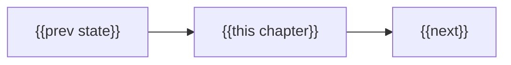

# Chapter {{N}} — Scope: {{Chapter Title}}

> **Status:** PLANNED. Scopes each lesson (~500 words). After approval, each
> lesson is expanded into `README.md` + `script_c{N}_l{M}.md` + `slides_c{N}_l{M}.html`.

## Chapter arc

{{2–4 sentences: where the previous chapter left us, what this chapter adds, and
the through-line. Optional Mermaid flow:}}

The running example throughout: {{…}}.

---

## Lesson {{M}} — {{Lesson Title}}

**Learning goal:** {{completes "you will be able to…"}}

**Format:** {{slides | slides + hands-on | demo}}

**Scope.** {{what this lesson teaches, the why-before-what framing, and the key
points. Include short code where it clarifies.}}

**Repo artifacts:** {{files/paths this lesson uses or creates}}

---

## Resolved decisions

1. {{decision made before building, so the content is unambiguous}}
